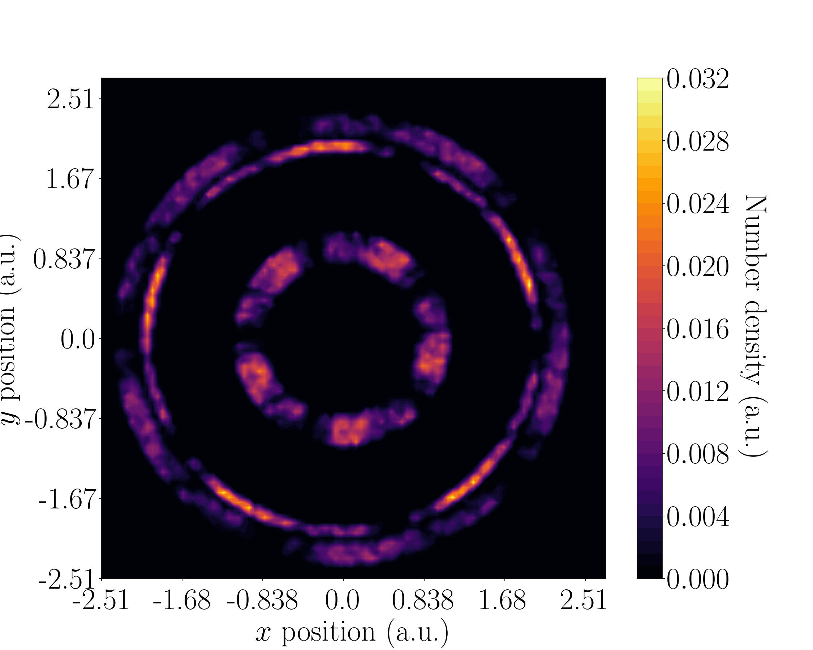
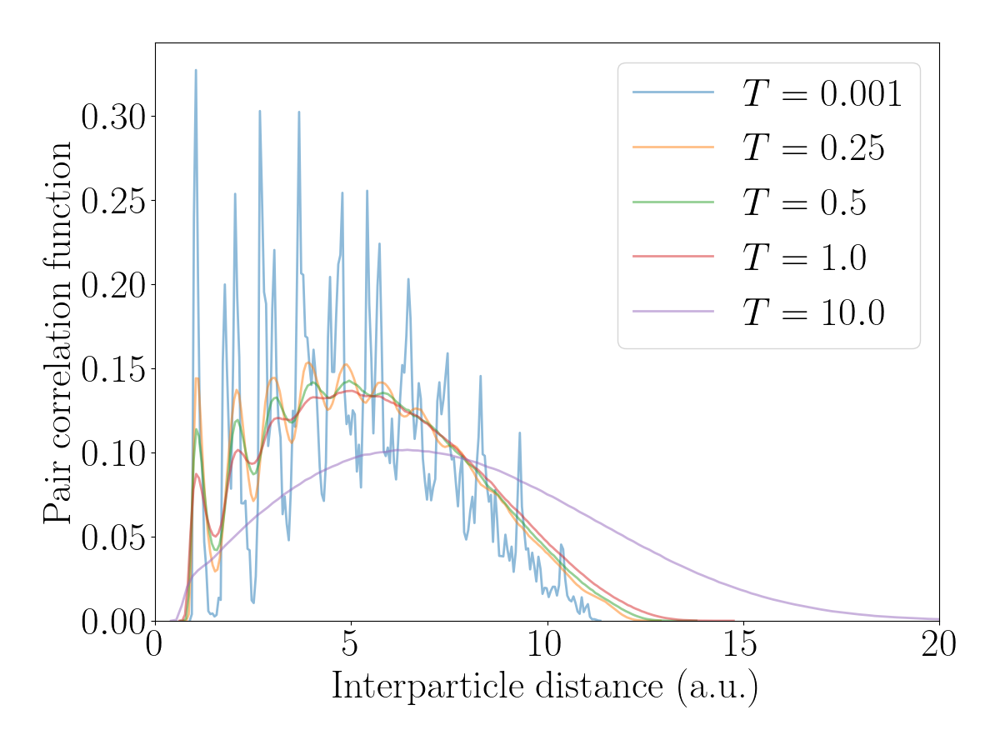

# Classical Simulation of Dipolar Atoms in a Trap
This program classically simulates N dipolar atomic atoms in a harmonic trapping potential using the Metropolis-Hastings Monte Carlo algorithm for sampling the Boltzmann distribution.

I implemented the algorithm in C as well as calculations for the number density, pair density and reblocking. I used Python and various scientific libraries for data analysis and the production of plots, examples of which are shown below.

    
    

## Dependencies
- `gsl`
- `matplotlib`
- `numpy`
- `scipy`
- `seaborn`
- `tomlc99`
- `tomli`
